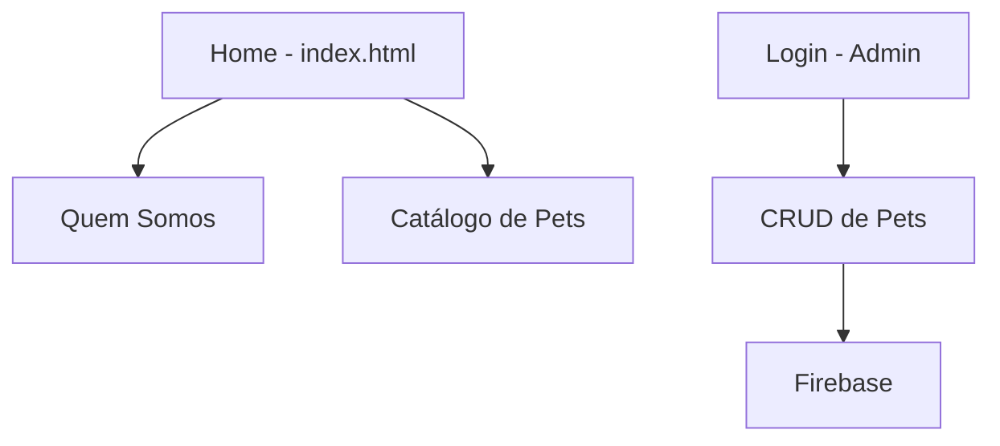

# Projeto ONG - Site de Adoção de Pets

Este projeto consiste em um site desenvolvido para uma ONG de adoção de animais, permitindo a visualização dos pets disponíveis e a gestão dos dados por administradores.

## Tecnologias Utilizadas

- **HTML/CSS/JavaScript**: Para estrutura e estilização do site.
- **Firebase**: Utilizado para o CRUD de pets, possibilitando o armazenamento e gerenciamento das informações.
- **package.json**: Gerenciamento de dependências do projeto.

## Estrutura do Projeto

1. **index.html**: Página inicial com informações gerais sobre a ONG.
2. **Quem Somos**: Página que apresenta a equipe da ONG e sua missão.
3. **Catálogo de Pets**: Exibe todos os pets disponíveis para adoção.
4. **Login de Administradores**: Tela exclusiva para administradores, exigindo login e senha.
5. **CRUD de Pets**: Área restrita onde administradores podem adicionar, editar e remover informações dos pets.

## Como Usar

1. **Configuração**: Certifique-se de que as dependências listadas no `package.json` estão instaladas.
2. **Deploy**: O site foi implantado na Vercel, disponível para acesso público.
3. **Autenticação de Admin**: Acessível apenas com login e senha cadastrados para os administradores gerenciarem o conteúdo de pets.

## Estrutura de Navegação do Projeto



## instalação

1. clone o repositorio ou abra usando uma pasta zip
2. instale dependencias usando.

    ```bash
    npm install
    ```

Configure o Firebase e as credenciais de admin conforme necessário no arquivo de configuração.